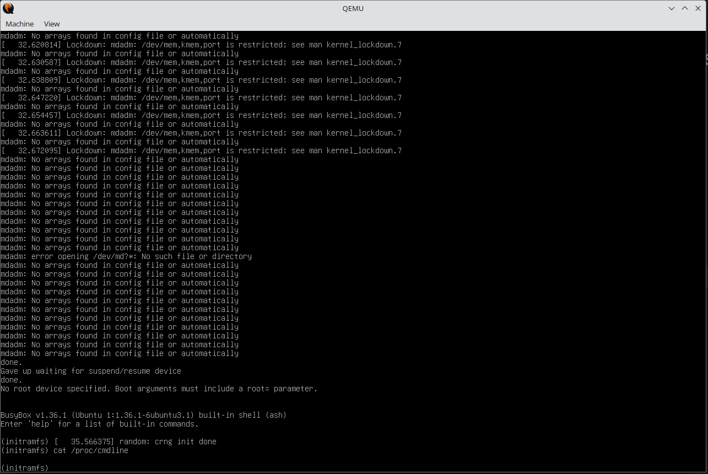
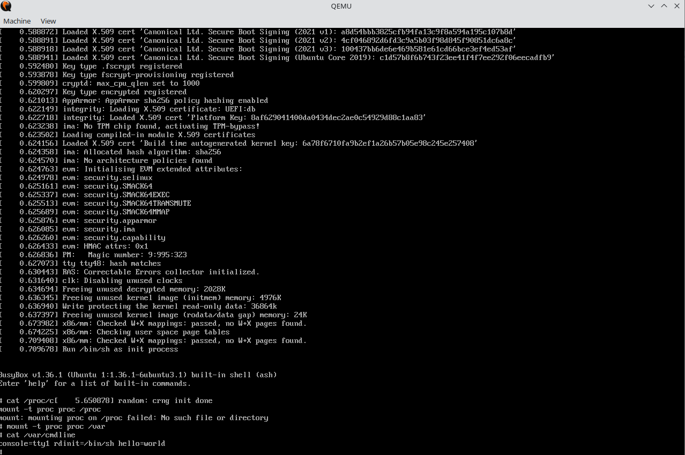

# ISSUE

cmdline: [grub.cfg](./grub.cfg)

```bash
search --file --set boot_root /linux.efi
echo "boot_root: ${boot_root}"
ls (${boot_root})/
if chainloader (${boot_root})/linux.efi console=tty1 rdinit=/bin/sh hello=world; then
  boot
else
  echo "FAILED"
fi
```

## SECURE BOOT ON



=> NO /proc/cmdline !!!

## SECURE BOOT OFF



=> GOOD /proc/cmdline !!!
